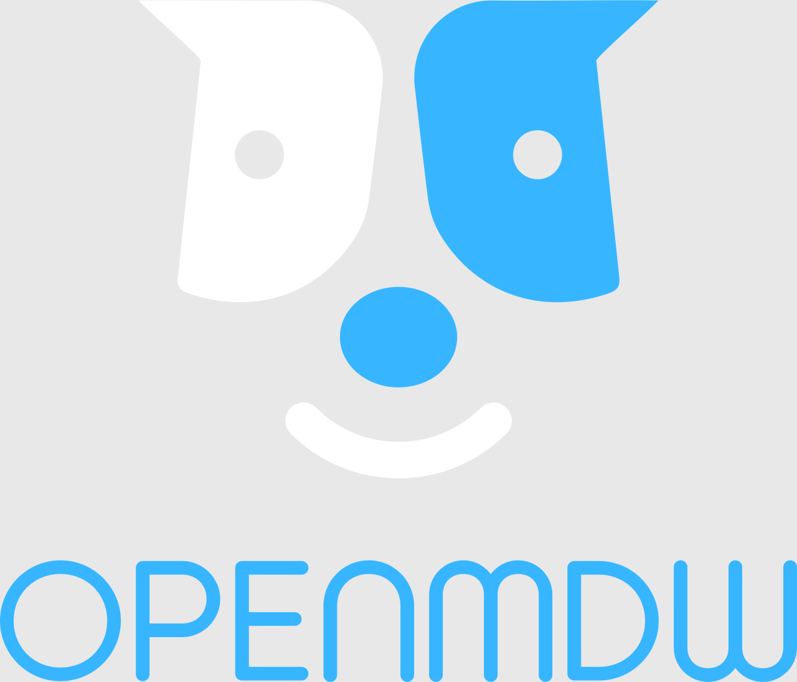

  

**OpenMDW License Agreement v1.0: Overview and Purpose**  
The OpenMDW License Agreement v1.0 is a draft permissive license specifically crafted for machine‑learning models and their related artifacts, collectively referred to as “Model Materials.” It aims to provide a single, easy‑to‑apply license agreement that ensures consistency and clarity across all components of an open AI model release.

## Overview

The OpenMDW License Agreement v1.0 is a permissive license specifically crafted for machine‑learning models and their related artifacts, collectively referred to as "Model Materials."

It aims to provide a single, easy‑to‑apply license agreement that ensures consistency and clarity across all components of an open AI model release.

The development of OpenMDW v1.0 originated from the [Model Openness Framework (MOF)](https://isitopen.ai) and complexities that arose from its use in practice. While OpenMDW (like the MOF) does not mandate completeness via providing particular Model Materials, its use is intended to help ensure that the Model Materials which are provided--and outputs generated via use of the Model Materials--can be used by all in an open manner.

## Using OpenMDW for your model

The current version of the OpenMDW License Agreement, version 1.0, is available in this repository at [`1.0/LICENSE.openmdw`](./1.0/LICENSE.openmdw). To use it for your own model, please copy that file to the root of your repo where your model is located, and rename the file to `LICENSE`.

Please keep in mind that, unless otherwise indicated, any other materials included in your distribution will be made available under the OpenMDW license. If your distribution includes other materials that you do not wish to (or cannot) make available under OpenMDW, you will need to clearly indicate any other applicable terms--such as third-party licenses applicable to any materials you distribute.

## More information

Please see the [OpenMDW-1.0 FAQ](./FAQ.md) for more details about OpenMDW-1.0 and its usage.

Documentation in this repository, other than the OpenMDW-1.0 license text itself, is made available under Creative Commons Attribution 4.0 International (CC-BY-4.0), a copy of which is in [`CC-BY-4.0.txt`](./CC-BY-4.0.txt).

The OpenMDW-1.0 license text is made available for use, modification and redistribution without restriction; however, you may not use the name "OpenMDW" or anything confusingly similar to refer to any modified version.
